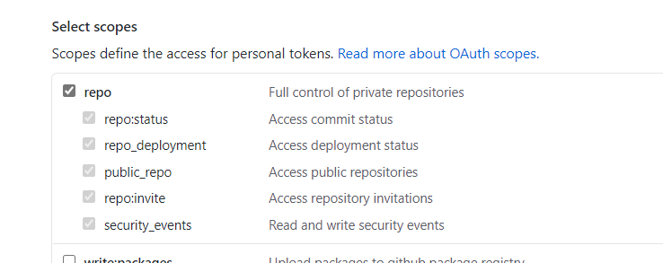

# Template Workflow to deploy a ACR image to AKS using event grid

The workflows in this repo show how to deploy any image from azure container registery to azure kubernetes cluster using event grid subscription to container registery.
Based on the events trigerred the corresponding workflow will be trigerred.
- Workflow 1- subscribe to ACR -->create image and push to ACR which will trigger image-push event in event grid.
- Workflow 2- the image pushed to ACR is deployed to AKS. 

# Getting started

### 1. Prerequisites

The following prerequisites are required to make this repository work:
- Azure subscription
- Contributor access to the Azure subscription
- Resource group created on azure portal
- Azure container registery resource created in the resource group
- Azure kubernetes cluster service created in the resource group

### 2. Create repository

To get started with ML Ops, simply create a new repo based off this template, by clicking on the green "Use this template" button:

<p align="center">
  
</p>

### 3. Setting up the required secrets
#### To allow GitHub Actions to access Azure
An [Azure service principal](https://docs.microsoft.com/en-us/azure/active-directory/develop/app-objects-and-service-principals) needs to be generated. Just go to the Azure Portal to find the details of your resource group. Then start the Cloud CLI or install the [Azure CLI](https://docs.microsoft.com/en-us/cli/azure/install-azure-cli?view=azure-cli-latest) on your computer and execute the following command to generate the required credentials:

```sh
# Replace {service-principal-name}, {subscription-id} and {resource-group} with your 
# Azure subscription id and resource group name and any name for your service principle
az ad sp create-for-rbac --name {service-principal-name} \
                         --role contributor \
                         --scopes /subscriptions/{subscription-id}/resourceGroups/{resource-group} \
                         --sdk-auth
```

This will generate the following JSON output:

```sh
{
  "clientId": "<GUID>",
  "clientSecret": "<GUID>",
  "subscriptionId": "<GUID>",
  "tenantId": "<GUID>",
  (...)
}
```

Add this JSON output as [a secret](https://help.github.com/en/actions/configuring-and-managing-workflows/creating-and-storing-encrypted-secrets#creating-encrypted-secrets) with the name `AZURE_CREDENTIALS` in your GitHub repository:

<p align="center">
  
</p>

To do so, click on the Settings tab in your repository, then click on Secrets and finally add the new secret with the name `AZURE_CREDENTIALS` to your repository.

Please follow [this link](https://help.github.com/en/actions/configuring-and-managing-workflows/creating-and-storing-encrypted-secrets#creating-encrypted-secrets) for more details. 


#### Credentials required to push/pull to azure container registry
Following secrets are credentials required to access azure container registry.
- REGISTRY_PASSWORD
- USERNAME

These can be set using the azure credentials generated above-
- REGISTRY_PASSWORD will be value of "password" from the azure credentials generated.
- USERNAME will be value of "clientId" from the azure credentials generated.

These secrets will be added as shown below-
<p align="center">
  
</p>

#### To Allow Azure to trigger a GitHub Workflow
 We also need GH PAT token with `repo` access so that we can trigger a GH workflow when the training is completed on Azure Machine Learning. 
 
 <p align="center">
  
</p>
 
 Add the PAT token with as [a secret](https://help.github.com/en/actions/configuring-and-managing-workflows/creating-and-storing-encrypted-secrets#creating-encrypted-secrets) with the name `PATTOKEN` in your GitHub repository:
 <p align="center">
  
</p>

### 4. Setup and Defining Triggers
#### Setup

We have precreated workflow [setup_acr_trigger](/.github/workflows/setup_acr_trigger.yml) that creates an event grid subscription to our Azure Container Registry.
User needs to set the following environment variables in this workflow-
- RESOURCE_GROUP
- CONTAINER_REGISTRY_NAME

After setting environment variables changes can be saved by commit which will trigger this workflow for setting up required resources.

#### Defining triggers
You need to update the workflow file [deploy_image](/.github/workflows/deploy_image.yml) with values for following environment variables-
- RESOURCE_GROUP
- CLUST_NAME
  
### 5. Running & Testing the trigger

#### Option 1:
After setup is done we can use command line to push image to our container registry using following docker login and push command-
- Use below command to login to your regisry-

    ``` docker login {{container-registry-name}}.azurecr.io ```
 
  User will be promted for username and password to access the docker registry server which can be taken from azure credentials generated in step 3-
    - USERNAME: 'clientId' part of credentials generated
    - PASSWORD: 'clientSecret' part of credentials generated
    
- Use below command to push image to registry-
    
     ``` docker push {{container-registry-name}}.azurecr.io/{{repo-name}}:{image-tag} ```
  
This will trigger workflow [deploy_image](/.github/workflows/deploy_image.yml) which will deploy the pushed image to AKS.

#### Option 2:
A sample workflow [push_sample_image](/.github/workflows/push_sample_image.yml) is available which can be used to push image provided to ACR.
We can update this workflow trigger it by making a commit to it.
This trigger will push image to ACR and trigger workflow [deploy_image](/.github/workflows/deploy_image.yml) to deploy the image to AKS.

### 6. Deployment parameters
 The deployment parameters related to deployment to aks can be changed accordingly by updating values in the following file-
 - charts/values.yaml
